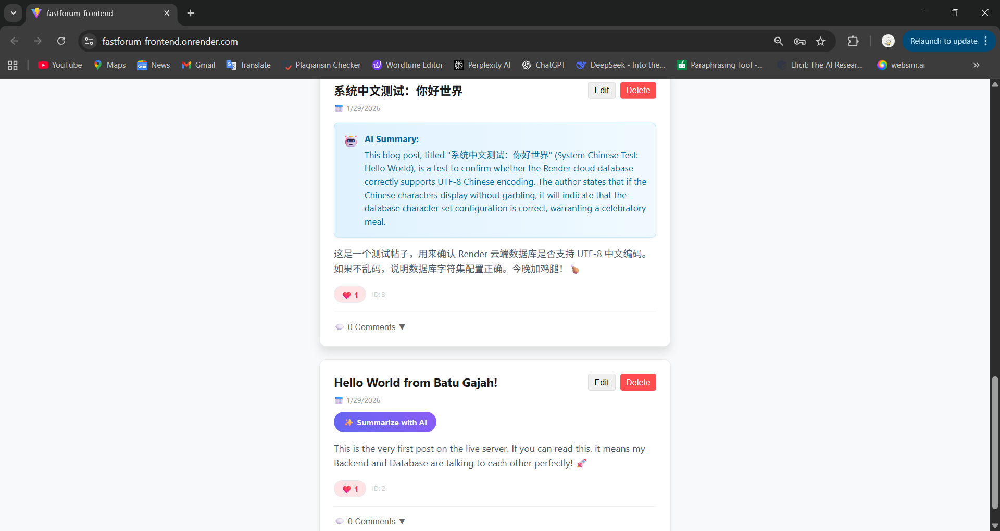

# FastForum - Full Stack Social Platform


A modern, full-stack social media application built with **FastAPI** and **React**, featuring secure authentication and AI-powered content summarization.

---

## 🚀 Live Demo

### [👉 Click here to view the Live App](https://fastforum-frontend.onrender.com/)

> **⚠️ Important Note regarding the Demo:**
> Since this project is hosted on **Render's Free Tier**, the server puts itself to sleep after 15 minutes of inactivity.
> **Please allow 30-50 seconds for the initial load.** Once it wakes up, it runs smoothly! ☕

---

## ✨ Key Features

* **🔒 Secure Authentication:** Implemented OAuth2 flow with JWT tokens. Passwords are hashed using **Argon2** (modern standard) for maximum security.
* **🤖 AI-Powered Summarization:** Integrated **Google Gemini** via **LangChain**. Users can click a button to get an on-demand summary of long posts.
* **☁️ Cloud Deployment:** Fully deployed on **Render (Linux environment)** with automated CI/CD pipelines.
* **🗄️ Robust Database:** Managed via **PostgreSQL** and **SQLAlchemy**, with **Alembic** handling schema migrations.
* **💬 Interactive Community:** Users can create posts, vote, and view real-time updates.

---

## 🛠️ Tech Stack

### Backend
* **Framework:** FastAPI (Python)
* **Database ORM:** SQLAlchemy
* **Migrations:** Alembic
* **Validation:** Pydantic
* **Security:** Pwdlib (Argon2), Python-Jose (JWT)
* **AI Integration:** LangChain, Google Generative AI

### Frontend
* **Library:** React.js
* **Styling:** CSS

### DevOps & Infrastructure
* **Cloud Provider:** Render
* **Database:** PostgreSQL
* **Environment Management:** Python venv

---

## 📸 Screenshots



---

## 🔧 Local Installation

If you want to run this project locally:

1.  **Clone the repository**
    ```bash
    git clone [https://github.com/SengFong03/fastforum.git](https://github.com/SengFong03/fastforum.git)
    cd fastapi-social-api
    ```

2.  **Backend Setup**
    ```bash
    cd backend
    python -m venv venv
    # Windows
    .\venv\Scripts\activate
    # Mac/Linux
    source venv/bin/activate
    
    pip install -r requirements.txt
    ```

3.  **Environment Variables**
    Create a `.env` file in the `backend` folder and populate it with your database credentials and API keys.

4.  **Run the Server**
    ```bash
    uvicorn app.main:app --reload
    ```

---

## 📬 Contact

Project Link: [https://github.com/SengFong03/fastforum.git](https://github.com/SengFong03/fastforum.git)